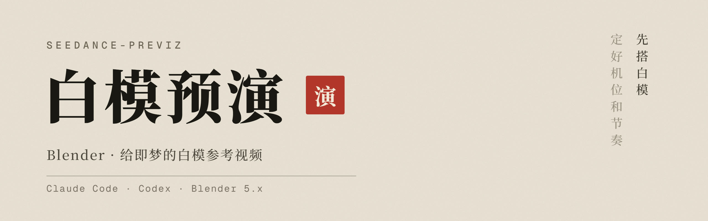
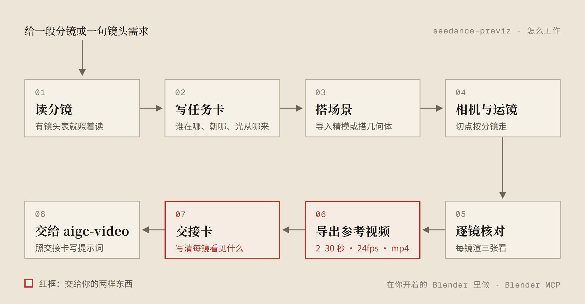

<div align="center">

# seedance-previz

[](#需要什么)
[](#能做什么)
[](#需要什么)
[](#需要什么)
[](#需要什么)

<br>

**在你开着的 Blender 里搭白模，交一段能直接传即梦的参考视频。**

<br>

机位、路线和节奏先在白模里定下来，即梦照着拍，不用靠文字猜运镜。<br>
每次交两样东西：一段白模参考视频，一张交接卡。<br>
交接卡写清每一镜看见什么、哪个颜色的模型对应哪个角色，给 [aigc-video](https://github.com/Wanrd0Geri/aigc-video) 写提示词用。

[能做什么](#能做什么) · [怎么工作](#怎么工作) · [需要什么](#需要什么) · [案例](#案例)

</div>

---

## 能做什么

| 你说 | 你拿到 |
|---|---|
| 「搭白模」「用 Blender 做这段的运镜」，附上分镜或 aigc-video 的镜头表 | 一段白模参考视频（mp4），加一张交接卡 |
| 已经有精模 | 只导入副本、摆放、做运镜，原文件不动 |
| 没有素材 | 用几何体搭场景，角色只留躯体代理（官方说这种粗白模效果更好） |
| 人形打斗 | 角色用分段长方体代理，动作带预备和过冲，镜头带手持 |
| 龙、蛇这类长条生物 | 身体不建，只放一个头部标记，镜头一直看着它 |

它不做精细建模、材质和最终渲染，也不写提示词。提示词交给 aigc-video。

---

## 怎么工作



几条底线，都来自即梦官方要求或实测：

- **角色不带四肢。** 粗白模只留躯体；带了四肢，提示词就得把四肢动作全写出来，否则成片会僵。
- **颜色用中性灰。** 白模的颜色会渗进成片，饱和度不超过 0.3。
- **主体要够大、要动。** 每镜主体不小于画面高度的一成，至少移动半个身高；又小又不动会被整个丢掉。
- **辅助线全关。** 轨迹线、坐标轴、相机框都不能出现在视频里。
- **一盏主光带投影。** 方向就是成片的光向，即梦会从白模里读光。
- **视频规格。** 每段 2–30 秒，24 fps 以上，短边不小于 480，mp4。

---

## 需要什么

- Blender 5.x、ffmpeg（含 ffprobe）、Python 3。
- Blender MCP：宿主里注册一个叫 `blender` 的 MCP，Blender 里装 `blender_mcp` 插件。Claude Code 和 Codex 都要注册，用 `claude mcp list` / `codex mcp list` 确认。插件更新命令：`uvx mcp-for-blender install-addon`。

MCP 连的是开着窗口的 Blender，插件的连接服务要开着。一键带窗口启动并开服务：

Windows（PowerShell）：

```powershell
& "C:\Program Files\Blender Foundation\Blender 5.2\blender.exe" --python "$HOME\Documents\Codex\seedance-previz\scripts\start_blender_mcp.py"
```

macOS：

```bash
/Applications/Blender.app/Contents/MacOS/Blender --python ~/Documents/Codex/seedance-previz/scripts/start_blender_mcp.py
```

也可以手动连：Blender 侧边栏 BlenderMCP 页签，点 Connect to MCP server。

> [!WARNING]
> 这个 Blender 插件默认会把提示词、代码和截图发给插件方。要关掉，让助手调 MCP 的 `disable_telemetry`；要重新打开，到 Blender 偏好设置的插件页里改。

自测，应输出 `SELFTEST OK`（Windows 上 `python3` 不可用时换成 `py -3`）：

```bash
python3 -X utf8 $HOME/Documents/Codex/seedance-previz/scripts/selftest.py
```

安装和同步按 [skills-setup](https://github.com/Wanrd0Geri/skills-setup) 做。

<details>
<summary><b>跨平台与环境细节</b>（点开）</summary>

- 脚本只用 Python 标准库，临时目录用 `tempfile.gettempdir()`，字幕字体按平台找系统中文字体。`scripts/encode.py` 是跨平台的编码入口，`encode.sh` 只是转调它。
- 找 Blender：`scripts/selftest.py` 依次查环境变量 `BLENDER_EXECUTABLE`（或 `BLENDER`）、PATH、常见安装位置（macOS `/Applications/Blender*.app`；Windows `C:\Program Files\Blender Foundation\Blender *\blender.exe`，取最新版）。找 ffmpeg 同理，可以用 `FFMPEG_DIR` 指定 bin 目录。
- 实测情况：Windows 11 + Blender 5.2 自测通过；窗口 MCP 路线 2026-10-01 在 Windows 11 + Blender 5.2.1 上完整做过一条。macOS 未验证。
- 完整自测见 `references/export-verify.md` 第 6 节。
- `notes/` 放施工图，只留在本机，不进仓库。

</details>

---

## 案例

`cases/` 里有三条做过的白模：

| 日期 | 做法 |
|---|---|
| 2026-09-25 | 建筑场景加躯体代理 |
| 2026-10-01 | 长条生物只放头部标记，环境半透明，闪电用白场；Windows 窗口 MCP 路线 |
| 2026-10-02 | 双人打斗，分段长方体代理，带运动质感，多机位 |
